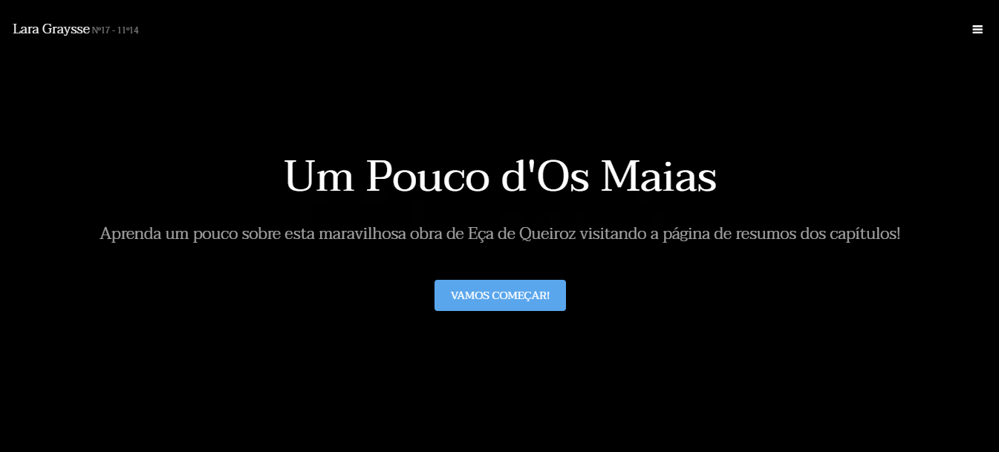

## EDUCATIONAL WEBSITE

 This website was built back in 2019 high school when I was in the IT course in Lisbon. 

  

### 📑 ABOUT THE WEBSITE
The purpose of this website was to present a creative portuguese project about "Os Maias", a history written by Eça de Queiroz, and since we were in an IT course and the area I liked the most was Web Development, I decided to make a simple website for this portuguese "exam" project. 

The website was built with 4 pages. Home, Chapter's Summary, Characters and Quizz.  
The home page has only a brief explanation of what "Os Maias" is.  
The chapter's summary page has a summary for each one of the 18 chapter's.  
The characters page has details about the characters.  
The quizz page has a small question game with 20 questions about the history.

### 👩‍💻 USED TECHNOLOGIES
On this website I worked with:  
- HTML5.
- CSS3.
- Javascript.

### 📌 POSSIBLE UPGRADES
I'm uploading this project on github because I think this is something I can work on to improve and practice my habilities so, possibly in my free times I'll be doing some updates on this website without changing it's original objective, just it's appeareance.

### 🔏 LICENSE

This project is under license. Check it out [LICENSE](LICENSE) for more details. 

##

[☝🏽 back to top](#educational-website)
